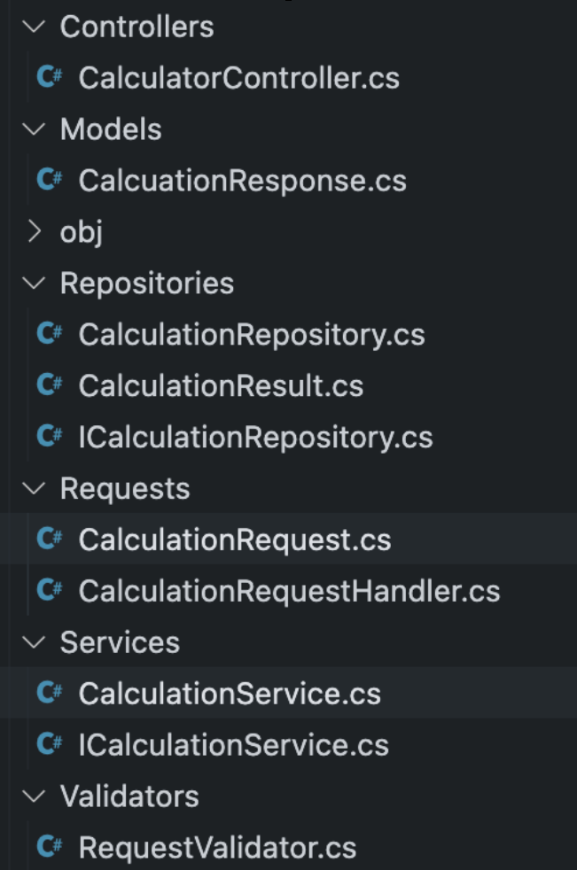

# To clean or not to clean

### 24/3/2026

## Productivity boost

As we start as software developers, we have levels where we start to feel gains in productivity boost. To give a few of these steps, they look as follows:

- Starting to code
  - You start to code, and every change to the code you make changes something; it feels like a superpower and it feels productive!
- You learn about Unit Tests
  - Now you are able to ensure that the code you wrote continues to function as you expect by having a lot of checks to ensure it behves as you expected even after a change! Now you get more productive because you don't have to look at areas you haven't changed to know they aren't broken.
- Clean Code enters the mix
  - You learn about clean code and how it can help with modularity and even increase the ease of unit testing. It makes it faster to iterate, and all this seperation of concerns means you no longer need to know whats going on behind the interface and you can use it and be productive with it.
- Design Patterns
  - You learn about design patterns and you gain even more productivity. Now you don't need to think about the solution to the technical problem; someone already did that for you!

And of course, with all this extra productivity, you're able to make perfect code that works 100% of the time all the time, right?

Of course not, we all still make mistakes, interactions happen we can't expect, and code changes so fast we can't possibly now what's happening. However, we still feel more productive for it and it's accepted throughout the industry.

But you know who isn't neccisarily more productive? They are 2 of your closest friends when it comes to programming and running yor programs. They are, of course, your CPU and your RAM. Both of these need to work overtime to run all these extra pieces of code with all these levels of indirection as they follow insturctions to pointers all around memory and keeping enough in the CPU cache becomes a difficult job. But of course this all sound like speculation, how can we prove it?

Of course in order to look at how the performance can be affected by these, we can use a benchmark to determine how fast the code will run. So let's benchmark it! To check this out, we start with a project that is fully using all the best practices, it will be a basic and simple calculation service which takes in a JSON request with a left, right and calculation type fields (the example code in the repo only supports addition and subtraction). It performs the relevent operation, stores it in the 'database' (an in-memory list) and returns the result.

For this benchmark, we then record how long it takes for the API to respond to all requests and take that figure as our benchmark. To ensure that outliers and erroneous results would be removed, the test was run at many different levels and multiple times,

- The test was run with sending the following number of requests
  - 10
  - 100
  - 1,000
  - 10,000
- It was also ran 10 times per run
  - Out of these 10 we printed the minimum, maximum and average of the runs
  - Each was ran 3 times and then averaged again to get the final numbers

## Starting Point

So let's have a look at the initial project.

<div style="max-width: 70%">



</div>

This project uses all the latest and greatest techniquies available to use to date! It has Services, Interfaces, Repositories, it's using Dependency Injection and some pretty great libraries named [MediatR(for CQRS)](https://mediatr.io/) and [Fluent Validation](https://docs.fluentvalidation.net/en/latest/) to make it easier to validate our incoming requests! This structure may look familiar if you've worked in larger dotnet projects in the past.

So to begin with, let's look at how this performs in the benchmark (for brevity, I am only showing the averaged tables; if you wish to see each individual run, see the ['end recordings' file](https://github.com/grab-a-byte/to-clean-or-not-to-clean/blob/main/StartPoint/end-recordings.md) on Github):

| Num Requests | Min(ms) | Max(ms) | Average(ms) |
| ------------ | ------- | ------- | ----------- |
| 10           | 0       | 47      | 4.7         |
| 100          | 2       | 3       | 2.2         |
| 1,000        | 14      | 24      | 16.9        |
| 10,000       | 140     | 222     | 170.2       |

For the rest of the article, I will be mainly focussing on the bottom right figure, which is the average of the averages across the 10k requests. Why this particular number? It is where we are seeing the most variance in the results, so it's easier to draw conclusions from this figure. All the tables are available wih full figures for your viewing in the ['end-recordings' document](https://github.com/grab-a-byte/to-clean-or-not-to-clean/blob/main/StartPoint/end-recordings.md).

## Removing Libraries

So let's start by doing something rather drastic, removing libraries! This might seem radical, however, it only requires a few minor changes to the codebase (likely more in a fully fledged project)

- Removing the MediatR library
- Removing Fluent Validations
- Injecting the MediatR Handlers directly (by replicating the interface in our project)
- Replacing the Fluent Validation with a static validation function that returns an object of the same shape to be a drop-in replacement.

To show how the code looks now, here are a couple of snippets from the code:

```c#
public class CalculatorController(ICalculationRequestHandler calculationRequestHandler) : ControllerBase
{
    [HttpPost()]
    public async Task<IActionResult> Calculate([FromBody] CalculationRequest request)
    {
        ValidationResult validationsResult = RequestValidator.Validate(request);
        if (validationsResult.IsValid is false)
        {
            return BadRequest(JsonSerializer.Serialize(validationsResult.Errors));
        }

        CalcuationResponse res = await calculationRequestHandler.Handle(request, CancellationToken.None);
        return Ok(res);
    }
}
```

and the newly founded validation code looks like so

```c#
public record ValidationResult(bool IsValid, IEnumerable<string> Errors);

public static class RequestValidator
{
    private const int MaximumValue = int.MaxValue / 2;
    private static readonly string[] KnownCalculationTypes = ["Subtraction", "Addition"];

    public static ValidationResult Validate(CalculationRequest request)
    {
        List<string> errorMessages = [];
        if (request.Left > MaximumValue)
        {
            errorMessages.Add($"Left hand side must be less than {MaximumValue}");
        }
        if (request.Right > MaximumValue)
        {
            errorMessages.Add($"Right hand side must be less than {MaximumValue}");
        }
        if (KnownCalculationTypes.Contains(request.CalculationType) is false)
        {
            errorMessages.Add("Service only supports addtion and subtraction");
        }

        return new ValidationResult(
            IsValid: errorMessages.Count != 0,
            Errors: errorMessages);
    }
}
```

The changes here aren't too radical and yet the amount of performance we gain from this is quite surprising. The figure for this is from `170.2ms` all the down to _drumroll please_ `160.4ms`! What an astronomical change. That `9.8ms` makes this a difference of about 5% in speed.

To put into perspective how much that is, it is the equivalentof taking a

- Intel i5 14600K
  - Released October 2023

and changing it into a

- Intel i5 13600K
  - Release September 2022

Which means we have essentially removed just over a year of hardware performance by using these libraries.

Why could this be? Well, there are a few reasons which I'd like to list below:

- Libraries are made to be generic
- They do more work under the hood in order to be generic
- The code you have to write for these tasks will likely be simpler and more tuned to your specific use case

But not only this, I would argue there are further points to be made and gathered form this such as the following:

- Simpler Developer Experience (DX)
  - Go to definition will find your function
  - You chose when to be async and use Tasks, not your library
- No need for MediatR Handler/Request separation and now going to definiton will just work, giving less context switching to the developer
- Validation logic can be all in one place instead of spread through many validators

Finally, by removing how many libraries you use, you by default remove the chances of being "rug pulled" by these libraries.

- (I have a seperate article on why I hate the term and idea of rug pulling, but it's the term most people know. You can read the article at [Open source going commercial is not rug pulling](./14-open-source-not-rug-pulls.md)).

So from this, you are able to protect yourself and the core parts of your business application as if it is in-house, you can debug it, own it and not have any chance of you not being able to use that piece of software.

## Removing interfaces

Now this may seem like a very radical idea. Many people will read the above title and scream preposterous! Interfaces are how we ensure that our code is decoupled and is reusable and can be dependency injected and that we can mock for test and.... so on and so on.

It's strange to think that for years, we didn't write code with interfaces because there wasn't enough hardware power to do so. Yes, I may be talking about back in the days when you used punchcards or FORTRAN or COBOL or many other similar languages, but we still managed to persevere without them.

So what will this look like when we try to apply it to the toy application we have built for this benchmarking scenario?

Well we have a few steps to do:

- Remove the idea of a handler and move the handler code to where it's being used (our 1 controller endpoint in this case)
- Delete the interfaces (and possibly services too)
- Deregister them from dependency injection (can't inject an interface that doesn't exist)

And that's all of it! Well, almost all of it, I've actually kept the repository interface as when it comes to testing, being able to mock and change your data storage to return whatever state is required for the test. While this seem counter intuitive, I think the only place where keeping interfaces around is necessary is in areas of Input/Output (IO) such as network requests or database access, as this allows you to make your unit tests isolateable.

So with this in mind, at this point in the testing, we are going to start with a average time of `167.4ms` (all shall be revealed why this number differs from the previous number later). So what do we gain by completing all this work and effort?

`162.8ms`

That's a difference of about `4.6ms`. If you prefer a percentage-based approach, that's about a 2.7% speedup in performace from removing these. Why would this be the case? Well lets think about a few points.

- Interfaces, by their very nature, do not know what they are calling
  - Imagine you are trying to optimize the kitchen of your favourite restaurant when you don't know what staff or cookware, or appliances they have.
- Every time you want to perform a function call, there is a lookup that the code has to do to know what it's calling due to the polymorphic nature of code
  - It's like if you need a task doing, and you have to ask your manager, who needs to ask their manager who then needs to ask one of their managed employees who knows and then it goes back through the chain instead of you just being able to ask Dave in the cafeteria for a coffee directly.
- By removing this indirection, we allow the compiler to see more of what is actually happening in our codebase
  - This opens up the door for a myriad of optimizations that simply aren't possible if the compiler doesn't know what it's calling.

## Final results from optimizing

So for those who are eagerly awaiting some more results, let's look at what applying all these things does for us.

So when we started, we were at `170.2ms` and when applying these, we go to `162.8ms`. That is a whole whopping `7.4ms` difference or a whopping `4%` perfomace boost!

Hmm... that doesnt really seem like much does it? Well, there is 1 figure I have left out up to this point.

`153.4ms`

Now that seems like it would be a major improvement. Even better than the score I listed previously, so where has this magical number came from? Well this figure is from ASP.NET Core just serving and handling the request with a `200 OK` response. With that in mind, let's build a new table!

| Overall time | ASP.NET | Difference |
| ------------ | ------- | ---------- |
| 170.2        | 153.4   | 16.8       |
| 162.8        | 153.4   | 9.4        |

This means our real difference is from `16.8ms` to `9.4ms` which is actually a `44%` speedup in the code we can control. That seems more like it!

As I've been using throughout the course of this article, I will once again use CPU's to compare. This is the equivalent of going from a

- Intel i5 14600K
  - Released October 2023
- Intel i5 11600K
  - Released March 2021

That's a whole 2 years and 9 months work of hardware innovation just wiped out in terms of speed just because of following these principles. Also, to note, one of the methods I tried did not cause a successful speedup, and still we are able to gain that much of a performance increase.

## Is Clean Code Bad?

Of course, saying all clean code is bad is too much of an overarching statement. Even with the remaining code, we still follow some of the principles listed, such as:

- Using meaningful names for variables (e.g. `index` instead of `i` or `idx`)
- No Magic Constants in the code (we give a name to the maximum amount we allow instead of hardcoding in line)
- Everything is formatted consistently (using our IDE's formatter)
- We also follow the KISS Principle (Keep It Super Simple) by removing many, many layers of code.

And how do we fare on following SOLID principles?

- Single Responsibility
  - Yes, the endpoint holds a single responsibility and will only change for that.
- Open-Closed Principle
  - Yes, we can still inherit all of these classes if needs be, and we have extension methods in C#
- Liskov's substitution principle
  - No, except for data store, as that’s the only interaction with the outside world
- Interface Segregation Principle
  - No, we delete as many as possible
- Dependency Inversion
  - No, dependencies are hard-coded but also we reduce the number of actual dependencies overall

Why does any of the following matter you may ask? I think there are 2 aspects to this. One is the technical side which I think lies within the following points:

- We may develop on machines with a Quad Core CPU and 16GB+ of RAM
- We deploy to a Kubernetes Pod with 0.5 a CPU core and maybe 0.5GB RAM if we are lucky

And the other part is the business case side:

- Market research has shown that 40% of consumers won’t wait more than 3 seconds for an eCommerce Site
- Stress levels increased by 33% when a page took more than 6 seconds
- A 0.1 second improvement of mobile site speed increased conversion rates by 8.4% for retail and 10.1% for travel sites

If you would like to know where these statistics come from, you can find them at [this link](https://queue-it.com/blog/ecommerce-website-speed-statistics/).

## The positives of ignoring best practices

I think with this example, there are many positives that came from removing best practice from the codebase. We can boil it down to the following:

- Easier to see when async Tasks are unneeded (e.g. removing MediatR, which was forcing the use of Task)
- Easier to follow code (Can read more in a single file)
- Fewer dependencies to manage
- Less context jumping around files.

Overall, this is all about removing complexity and making things simpler for the end user (a.k.a. the developer). It also benefits the customer who is able to get more done in a shorter length of time and has reduced stress levels.

## Why benchmarking is important

You may remember earlier in the post when I mentioned how one of the experiments I tried failed. For transparency, the idea I tried was moving some of the services into [Singletons](https://en.wikipedia.org/wiki/Singleton_pattern).

My thinking here was, if we don't need to keep allocating and freeing memory, we may be able to get a speedup by not having to ask the hardware to do so much. My theory was incorrect, and so the figures went from `160.4ms` average to `167.4ms` on average, which equates to about a 4% slowdown from making the switch.

I, for one, am glad of this result. It also helps to illustrate why benchmarking is important to show your assumptions are correct and that everything is actually moving in the right direction!

Thank you for reading, and I hope this helped to make you think twice about following the best practices when they may not always make sense.

## Related links

- [Github Repository](https://github.com/grab-a-byte/to-clean-or-not-to-clean)
  - I apologise that the slides were done in Apple Keynote and exported to PowerPoint so apologies for any strange formatting issues
- [Clean Code Horrible Performance Video](https://youtu.be/tD5NrevFtbU?si=ZUYDMo9WlqxWH1Eq)
