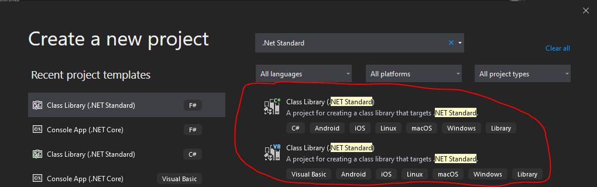

# Dotnet Interop:- C# and Visual Basic

### 2020-04-01

This is Part 1 in my series of Blog Posts on DotNet interop.
## Why Visual Basic?
I decided to use visual basic as my first way to show Interop as C# and Visual Basic both share the same programming paradigm of object orientation.

## A sample of the languages!
Below I have snippets of two classes which are mirrors of each other in both Visual Basic and C#.


### Visual Basic
```csharp
Public Class MyVBClass

    Private Multiplier As Integer

    Function AddTwo(A As Integer, B As Integer) As Integer
        Return A + B
    End Function

    Sub SetMultiplier(NewMultiplier As Integer)
        Multiplier = NewMultiplier
    End Sub

    Function MultiplyByMultiplier(NumToMultiply As Integer) As Integer
        Return NumToMultiply * Multiplier
    End Function

End Class
```
TODO: REMOVE THIS 

### C#
```csharp
using System;

namespace CSharpClassLib
{
    public class MyCSharpClass
    {
        private int multiplier;

        public int AddTwo(int A, int B) => A + B;

        public void SetMultiplier(int newMultiplier)
            => multiplier = newMultiplier;

        public int MultiplyByMutiplier(int numToMultiply)
            => numToMultiply * multiplier;
    }
}
```
TODO: REMOVE THIS ONCE DONE 

## So How Do We Get Started
Both of the above classes were created in their relevant .NET Standard lib file from Visual Studio.


Once these have been created and compiled, you will end up with a DLL file inside of the respecting ‘bin’ folders of each project. If these are in individual Solutions and compiled completely separately, you would need to copy this file over to the project you wish to use it in (say copy the Visual Basic DLL to a C# Console App), add a reference (using brose for file), and voila! That all that’s required, you can now use the Visual Basic code just like C# code as shown in the below example.

```csharp
using System;
using VBClassLib;

namespace CSharpConsole
{
    class Program
    {
        static void Main(string[] args)
        {
            MyVBClass myVBClass = new MyVBClass();
            var vbResult = myVBClass.AddTwo(1, 2);
            Console.WriteLine(vbResult);

            myVBClass.SetMultiplier(4);
            var myVBResult2 = myVBClass.MultiplyByMultiplier(4);
            Console.WriteLine(myVBResult2);
        }
    }
}
```
TODO: REMOVE THIS: 
If you didn’t know any better, you may assume that you were using a standard C# library!

To prove this point further, I have also created an Example that uses the popular C# Library Newtonsoft.JSON inside of a Visual Basic Project.

```csharp
Imports Newtonsoft.Json

Module Program
    Sub Main(args As String())

        Dim numbers = New Integer() {1, 2, 4, 8}
        Dim serializeResult = JsonConvert.SerializeObject(numbers)
        Console.WriteLine(serializeResult)

        Console.ReadKey()

    End Sub
End Module
```
TODO: REMOVE THIS!!!
Again, as simple as adding the NuGet Package and using it. Rather spectacular if you ask me.


## What if I can’t be bothered to copy files?

There is another point to be made here, if you are writing both in the same solution, you can add both projects to a solution file and Visual Studio is clever enough to compile both separately as well as allow you to link. I can’t imagine a scenario where you would want to do this (except for demo purposes) but it is cool this feature exists.

One small caveat with the above is that if you are using the VB Class Library in the C# console project and you update the VB Class Library, you will need to rebuild it before the changes are picked up by visual studio as usable in the C# project.

I am yet to find anything in VB which cannot be used in C# but I have only used VB a small amount and have kept it simple for this example, I would love to hear if anyone has found anything which causes complications and any question, feel free to ask and I will try to answer.

Thanks for reading!
